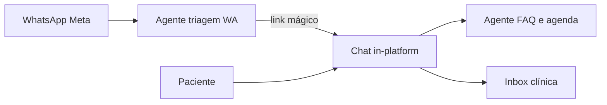

# Dental Seven — Guia Master (Superpowers)

**Versão:** 1.0  
**Data:** 2026-07-07  
**Branch de desenvolvimento:** `feat/v2`  
**Status:** Documento único de referência — usar este arquivo antes de qualquer feature

> Specs e planos em `docs/superpowers/specs/` e `plans/` são **anexos técnicos**. Em caso de conflito, **este guia prevalece** para ordem, status e decisões de produto.

---

## 1. Como trabalhar (Superpowers)

1. **Ler este guia** — confirmar fase, item atual e decisões firmes (§4).
2. **Brainstorming** → spec em `docs/superpowers/specs/YYYY-MM-DD-<tema>-design.md`.
3. **Aprovação do usuário** na spec.
4. **Writing plans** → `docs/superpowers/plans/YYYY-MM-DD-<tema>.md`.
5. **Implementação** com TDD + skills relevantes (ex.: odontograma 3D → `3d-web-experience`) + `npm run test` + `npm run build`.
6. **Atualizar §3 e §5 deste guia** ao concluir cada item (status ✅).

**Perguntas ao usuário:** 2–4 opções; uma marcada **(Recomendado)** com contexto do projeto.

---

## 2. Deploy e ambientes

| Ambiente | O quê | Regra |
|----------|--------|--------|
| **Produção** | Beta Founding Members (`main` → dental-seven-self.vercel.app) | Deploy beta no lugar do MVP (decisão 2026-07-13). Gate `DENTAL_SEVEN_BETA_GATE=true`. |
| **Desenvolvimento** | `feat/v2` local (`npm run dev`) | Continuar features; sync com `main` após merge beta. |
| **Pós-beta** | Mesmo domínio + `/visao` comercial | Desligar gate; reabrir planos/preços no cadastro. |

**Smoke local:** `http://localhost:3000` · admin `v2smoke-full-20260702@test.dr7.app` / `demo2026v2`

**Convite founding:** `https://dental-seven-self.vercel.app/founding`

---

## 3. Roadmap por versão (consolidado)

Legenda: ✅ entregue · 🔄 em andamento · 📋 planejado · ⏸ pós-beta

| Versão | Entrega | Status | Spec / notas |
|--------|---------|--------|----------------|
| **v1** | MVP demo: agenda, pacientes, WhatsApp simulado, gate senha | ✅ | `2026-06-11-dental-seven-mvp-design.md` |
| **v2** | Auth, roles, trial 7d, Asaas, planos/módulos, paywall, export LGPD, encerramento | ✅ | `2026-06-15-v2-design.md` |
| **v2.5** | Prontuário fase 1 — upload + storage | ✅ | `2026-07-02-v2.5-prontuario-design.md` |
| **v3** | Procedimentos + BOM | ✅ | `2026-07-02-v3-procedimentos-design.md` |
| **v3.5** | Prontuário fase 2 — viewer, PDFs, CID, rodapé | ✅ | `2026-06-30-v3.5-prontuario-viewer-design.md` |
| **v4** | Estoque + alertas + baixa automática | ✅ | `2026-07-02-v4-estoque-design.md` |
| **v5** | Financeiro | ✅ | `2026-07-02-v5-financeiro-design.md` |
| **v5.1** | Fornecedores | ✅ | `2026-07-02-v5.1-fornecedores-design.md` |
| **v6** | Super admin DR7 + WhatsApp real (Meta + n8n) | 🔄 Onda 1 cockpit beta | `2026-07-03-v6-superadmin-design.md` · `2026-07-11-admin-onda1-design.md` |
| **v6.1** | Agente IA único no WhatsApp (n8n + pgvector) | 📋 | § estratégia `2026-06-15` §4.4 |
| **Pré-beta** | Legal, planos, logo, deploy checklist | 🔄 | Este guia §5 |
| **v3.6** | Odontograma 3D interativo (+ fallback 2D) | ✅ | `2026-07-07-odontograma-3d-design.md` v2 |
| **v3.7** | Anamnese estruturada na ficha do paciente | ✅ | `2026-07-07-anamnese-design.md` |
| **v7.0** | Chat in-platform + link a partir do WhatsApp | ⏸ | Visão §7 abaixo |
| **v7.1** | Segundo agente IA no chat + handoff unificado | ⏸ | Ideia do usuário — após v6 real |
| **v8.0** | Convênios / planos odontológicos (fundação) | ✅ | `2026-07-10-convenios-planos-design.md` |
| **v8.1** | GTO PDF assistida | 📋 | derivar de v8.0 |
| **v8.2** | TISS XML + lotes + recurso glosa | 📋 | derivar de v8.1 |

### Equipe e agenda (feat/v2, pós-v5)

| Entrega | Status | Spec |
|---------|--------|------|
| Horários operacionais + navegação semanal agenda | ✅ | `2026-07-03-agenda-horarios-design.md` |
| Convidar dentistas + quota por plano | ✅ | `2026-07-03-equipe-dentistas-design.md` |
| Aceitar convite + checkbox termos | ✅ | `2026-07-06-legal-pages-design.md` |
| Rodapé PDF clínico | ✅ | `2026-07-03-pdf-footer-design.md` |

---

## 4. Decisões firmes (não reabrir sem o usuário)

| # | Decisão |
|---|---------|
| 1 | **Um app, um deploy** — módulos por `clinic_modules`, nunca dois apps |
| 2 | **Beta no domínio oficial** — MVP substituído em 2026-07-13; `/visao` permanece para pós-beta |
| 3 | **Trial 7d** sem cartão; cobrança Asaas no 8º dia |
| 4 | **Matriz planos 2026-07-07** — WhatsApp + `ai_agent` só **Completo**; prontuário desde **Conecta** (§6) |
| 5 | **Grandfather:** clínicas existentes não sofrem migration automática de módulos |
| 6 | **Beta honesta:** WhatsApp/IA simulados ou rotulados "em breve" até v6 |
| 7 | **Odontograma 3D** — **antes do deploy beta**; AHA-moment dos dentistas na beta |
| 8 | **Anamnese** — aba dedicada na ficha; template DR7 v1; alertas críticos |
| 9 | **Chat in-platform + dual IA** — v7+, após WhatsApp real v6 |
| 10 | **Termos/privacidade** — páginas públicas + checkbox cadastro e convite dentista |
| 11 | **Dentistas:** Essencial 1; Conecta+ até 3; extra +R$ 20/mês (4º+) |
| 12 | **Convênios v8:** módulo standalone `/convenios` (`module_key` `convenios`); Inteligente+; fila pós-beta item 7 (após anamnese); fases v8.0 fundação → v8.1 GTO → v8.2 TISS |

---

## 5. Fase atual: pré-beta (fila Superpowers)

Ordem obrigatória:

| # | Item | Status | Spec | Plano |
|---|------|--------|------|-------|
| 1 | Termos + Privacidade | ✅ | `specs/2026-07-06-legal-pages-design.md` | `plans/2026-07-06-legal-pages.md` |
| 2 | Reposicionar planos | ✅ | `specs/2026-07-07-plan-reposition-design.md` | `plans/2026-07-06-plan-reposition.md` |
| 3 | Logo da clínica | ✅ | `specs/2026-07-07-clinic-logo-design.md` | `plans/2026-07-06-clinic-logo.md` |
| 4 | **Odontograma 3D interativo** | ✅ | `specs/2026-07-07-odontograma-3d-design.md` v2 | `plans/2026-07-07-odontograma-3d.md` |
| 4b | Cadastro beta + banner + guia + sidebar sticky | ✅ | `specs/2026-07-13-beta-shell-ajuda-design.md` · `2026-07-11-cadastro-beta-design.md` | `plans/2026-07-13-beta-shell-ajuda.md` |
| 4c | Fim beta 07/08 + formulário `/feedback` + admin | ✅ | `specs/2026-07-13-beta-feedback-design.md` | `plans/2026-07-13-beta-feedback.md` |
| 5 | Deploy beta (MVP → beta no domínio oficial) | ✅ | `docs/beta-tester-roadmap.md` · §8 | — |
| — | Super Admin Onda 1 (cockpit beta + founding) | ✅ | `specs/2026-07-11-admin-onda1-design.md` | `plans/2026-07-11-admin-onda1.md` |

### Fila pós-beta (após item 5)

| # | Item | Status | Spec | Plano |
|---|------|--------|------|-------|
| 6 | Anamnese | ✅ | `specs/2026-07-07-anamnese-design.md` | `plans/2026-07-07-anamnese.md` |
| 7 | Convênios v8.0 (fundação) | ✅ | `specs/2026-07-10-convenios-planos-design.md` | `plans/2026-07-10-convenios-planos.md` |

**Critérios de aceite da beta (resumo):**

- [x] `/termos` e `/privacidade` + aceite no cadastro/convite
- [x] WhatsApp visível só no plano Completo (código + copy)
- [x] Logo uploadável — header + PDF
- [x] **Odontograma 3D** no prontuário — AHA da beta (validado 2026-07-13)
- [x] Cadastro beta sem preços + banner âmbar + Guia rápido `/ajuda` + sidebar sticky
- [x] Fim da beta 07/08/2026 no banner/founding + `/feedback` + lista admin
- [x] Deploy `feat/v2` no domínio oficial (substitui MVP — 2026-07-13)
- [x] Roadmap testers `docs/beta-tester-roadmap.md`
- [ ] Convite dentista + SMTP produção (config Supabase — validar após go-live)
- [x] `npm run test` e `npm run build` passam (pré-merge)

---

## 6. Planos comerciais (vigente 2026-07-07)

Preços inalterados. Fair use WhatsApp/IA **somente Completo** (2.500 / 3.500 mês).

| Módulo | Essencial R$99 | Conecta R$149 | Inteligente R$279 | Completo R$349 |
|--------|:--------------:|:-------------:|:-----------------:|:--------------:|
| agenda, pacientes | ✅ | ✅ | ✅ | ✅ |
| prontuario | — | ✅ | ✅ | ✅ |
| procedimentos | — | ✅ | ✅ | ✅ |
| estoque | — | — | ✅ | ✅ |
| financeiro | — | — | ✅ | ✅ |
| fornecedores | — | — | — | ✅ |
| whatsapp | — | — | — | ✅ |
| ai_agent | — | — | — | ✅ (flag; código v6.1) |

**Narrativa:** Essencial = rotina · Conecta = clínica digital · Inteligente = gestão · Completo = atendimento completo.

Detalhe comercial histórico: `2026-06-15-estrategia-modularidade-billing-ia.md` (§7 superseded na matriz; preços §3.4 válidos).

---

## 7. Visão pós-beta (ideias do usuário)

### Odontograma v3.6 (reboot jul/2026)

- Referência concorrência: arcada 3D, rotação, clique → card histórico
- **Skill:** `.agents/skills/3d-web-experience` (R3F + GLB Draco + fallback WebGL)
- Identidade DR7: fundo escuro, dentes cinza, highlight `--primary`
- Fallback 2D oclusal+raízes se spike no-go

### Anamnese v3.7 (spec aprovada pendente)

- Aba na ficha do paciente; questionário estruturado; alertas (alergia, gestante, cardiopatia…)
- Futuro: preenchimento via WhatsApp (v6)

### Chat in-platform + dual IA (v7+)

| Fase | Entrega |
|------|---------|
| v6 | WhatsApp real + inbox manual |
| v6.1 | Agente IA único no WhatsApp |
| v7.0 | Chat in-platform + link do WA |
| v7.1 | Segundo agente no chat + handoff |

**Pré-requisito:** v6 antes de qualquer agente ou chat real.

---

## 8. Deploy beta (quando chegar item 5)

**AHA-moment:** na demo/onboarding beta, o fluxo obrigatório inclui abrir **Prontuário → Odontograma 3D**, girar a arcada e clicar em um dente para ver histórico. Copy sugerida: *"Gire, clique e explore."*

Checklist (não executar até item 3 ✅ + commit aprovado):

1. Branch `feat/v2` → Vercel preview ou `dental-seven-beta`
2. Env: Supabase prod, `SERVICE_ROLE`, `NEXT_PUBLIC_APP_URL`, SMTP Supabase
3. Resend opcional (trial emails); Asaas sandbox
4. Redirect URLs Supabase no domínio beta
5. Doc `docs/beta-tester-roadmap.md` — o que funciona vs. "em breve"
6. **Não** substituir deploy MVP até merge/commit explícito

---

## 9. Índice de specs (anexos)

| Tema | Spec |
|------|------|
| MVP + roadmap original | `specs/2026-06-11-dental-seven-mvp-design.md` |
| Estratégia billing/IA | `specs/2026-06-15-estrategia-modularidade-billing-ia.md` |
| v2 core | `specs/2026-06-15-v2-design.md` |
| Pré-beta (histórico fatia jul/26) | `specs/2026-07-06-pre-beta-roadmap-design.md` |
| Legal | `specs/2026-07-06-legal-pages-design.md` |
| Planos | `specs/2026-07-07-plan-reposition-design.md` |
| Logo | `specs/2026-07-07-clinic-logo-design.md` |
| Odontograma 3D | `specs/2026-07-07-odontograma-3d-design.md` |
| Anamnese | `specs/2026-07-07-anamnese-design.md` |
| Convênios / planos odontológicos | `specs/2026-07-10-convenios-planos-design.md` |
| Super admin / v6 | `specs/2026-07-03-v6-superadmin-design.md` |
| Equipe dentistas | `specs/2026-07-03-equipe-dentistas-design.md` |

---

## 10. Changelog deste guia

| Data | Mudança |
|------|---------|
| 2026-07-07 | v1.0 — consolidação V1–V7 + pré-beta + decisões deploy + fila Superpowers |
| 2026-07-07 | Odontograma removido (UX visual rejeitada); deploy beta volta a ser item 4 |
| 2026-07-07 | Novas specs v3.6 odontograma 3D + v3.7 anamnese; fila pós-beta itens 5–6 |
| 2026-07-09 | Odontograma antecipado para pré-beta item 4; AHA-moment da deploy beta |
| 2026-07-10 | Spec + plano v8 Convênios/planos odontológicos; fila pós-beta item 7 |
| 2026-07-10 | Anamnese v3.7 implementada (migration 024, módulo anamnese, aba na ficha) ✅ |
| 2026-07-11 | Super Admin Onda 1 — fila de ações, founding pipeline, auditoria recente ✅ |
| 2026-07-13 | Odontograma 3D aprovado; cadastro beta + banner âmbar + guia `/ajuda` + sidebar sticky ✅ |
| 2026-07-13 | Fim beta 07/08 + formulário `/feedback` (`beta_feedback`) + admin ✅ |
| 2026-07-13 | Deploy: substituir MVP por beta em dental-seven-self.vercel.app; `/visao` pós-beta |
