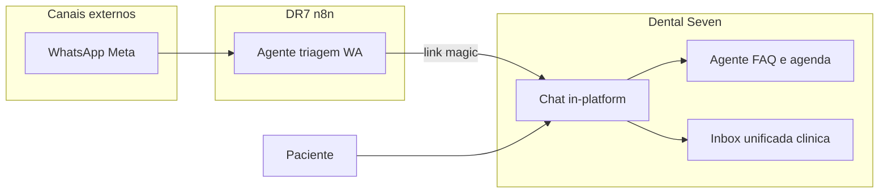
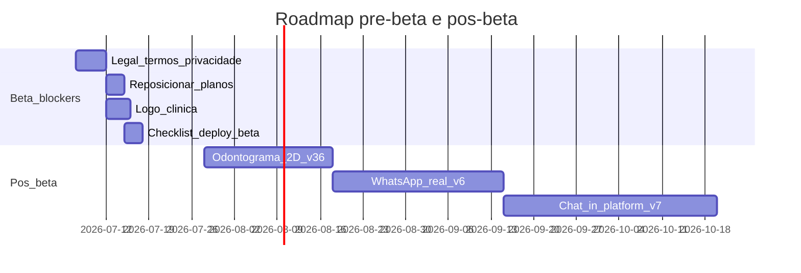

# Dental Seven — Roadmap pré-beta Design Spec

> **Superseded como guia de execução.** Use `docs/superpowers/GUIA-MASTER.md` (fonte única). Este arquivo permanece como histórico da fatia jul/2026.

**Versão:** 1.0  
**Data:** 2026-07-06  
**Status:** Aprovado para planejamento (recomendações DR7)  
**Branch:** `feat/v2`

---

## Princípio de decisão

Em cada iniciativa abaixo há **Recomendação** explícita, baseada no estado atual do código (`feat/v2`), specs comerciais existentes e custo/risco de implementação antes de dentistas reais testarem.

**Decisões recomendadas para a beta:**

| Tópico | Recomendação |
|--------|--------------|
| Escopo da beta | **Beta rápida** (~2–3 semanas): legal + logo + planos + deploy + checklist |
| WhatsApp nos planos | **Só Completo** (R$ 349); módulos clínicos nos planos intermediários |
| Odontograma | **Pós-beta** (v3.6) — 2D híbrido, sem 3D na v1 |
| Chat in-platform + dual IA | **Pós-v6** (v7+) — não bloquear beta |
| Logo da clínica | **Incluir na beta** — upload + PDF + header |
| Termos + privacidade | **Incluir na beta** — obrigatório para LGPD e cadastro |

---

## 1. Termos de uso e política de privacidade

### Situação atual
- Exportação LGPD e encerramento de conta existem
- **Não há** `/termos`, `/privacidade` nem checkbox no cadastro

### Recomendação
**Fazer antes da beta.** Risco legal e de confiança sem isso.

### Escopo v1
- Páginas públicas `/termos` e `/privacidade` — **textos adaptados de** [DR7 Termos](https://www.dr7performance.com.br/termos_de_uso) e [DR7 Privacidade](https://www.dr7performance.com.br/politica_de_privacidade)
- Spec detalhada: `docs/superpowers/specs/2026-07-06-legal-pages-design.md`
- Links no footer de `/entrar`, `/cadastro` e `/configuracoes`
- Checkbox obrigatório no cadastro: *"Li e aceito os Termos e a Política de Privacidade"*
- Registrar `terms_accepted_at` em `profiles` ou metadata (migration leve)
- Texto revisado por advogado/OS (DR7 fornece rascunho; dev só integra)

### Fora do escopo v1
- Cookie banner complexo (só se necessário para analytics)
- DPA separado B2B

**Plano:** `docs/superpowers/plans/2026-07-06-legal-pages.md`

---

## 2. Odontograma digital interativo

### Situação atual
- Prontuário v3.5: documentos, evoluções, PDFs — **zero odontograma**
- Procedimentos v3: catálogo + BOM; financeiro v5: receita ao concluir consulta

### Recomendação
**Não bloquear a beta.** Entregar na **v3.6** (4–6 semanas após beta), com abordagem **2D híbrida** (não 3D full na v1).

### Por quê
- 3D (Three.js) é alto custo e baixo retorno no dia a dia vs. mapa 2D FDI
- A ideia híbrida do texto (arcada 2D + mini painel por dente) cobre 90% do valor
- Integração com plano de tratamento exige modelo de dados novo — melhor spec dedicada

### Escopo v3.6 (proposta)
| Item | Detalhe |
|------|---------|
| UI | Arcada 2D FDI (32 permanentes + decíduos opcional v2); contorno neutro; clique preenche |
| Popover | Status (cárie, ausente, implante…), procedimento sugerido, nota curta |
| Dados | `patient_tooth_records` (patient_id, tooth_number FDI, status, faces[], note, updated_by) |
| Integração | Botão "Adicionar ao plano" → linha em lista de tratamentos (v4 do odontograma) |
| Onde | `/pacientes/[id]/prontuario` — nova seção acima de evoluções |
| 3D | **Backlog** — mini visualização por dente só se v3.6 validar demanda |

### Fora do escopo v3.6
- Arcada 3D giratória full
- Sincronização automática com financeiro por clique (fase 2)

**Plano:** `docs/superpowers/plans/2026-07-06-odontograma-v1.md` (após beta)

---

## 3. Deploy beta para dentistas reais

### Situação atual
- Produção pública (`main`): MVP demo com `DEMO_PASSWORD`
- Produto real: `feat/v2` — auth, planos, prontuário, estoque, financeiro, equipe, super admin
- WhatsApp e IA: **simulados** / flags comerciais

### Recomendação
**Sim, pode deployar para beta** — com escopo e comunicação honestos.

### O que a beta PODE prometer
- Agenda, pacientes, equipe, configurações, horários
- Prontuário (upload, PDFs, CID, rodapé)
- Procedimentos, estoque, financeiro (plano Completo)
- Trial 7d, paywall, export LGPD
- Convite de dentistas por e-mail

### O que a beta NÃO deve prometer (ainda)
- WhatsApp real (Meta API) — inbox é **demo/simulada**
- Agente IA funcionando — módulo existe só como flag
- Odontograma
- Chat in-platform

### Checklist deploy beta
1. Branch `feat/v2` → Vercel preview ou projeto `dental-seven-beta`
2. Env: Supabase prod, `SUPABASE_SERVICE_ROLE_KEY`, `NEXT_PUBLIC_APP_URL`, SMTP Supabase (convites)
3. Resend opcional (trial emails)
4. Asaas sandbox
5. Redirect URLs Supabase: domínio beta
6. Documento **"Beta Roadmap"** para testers (PDF/Notion) — o que vem em cada fase
7. Conta smoke + 2–3 clínicas piloto provisionadas pelo super admin

### Riscos aceitáveis na beta
- WhatsApp simulado **se** rotulado "em breve" ou oculto em planos sem módulo
- Módulos Completo desligados por default até super admin ativar

**Plano:** `docs/superpowers/plans/2026-07-06-beta-deploy.md`

---

## 4. Reposicionar WhatsApp nos planos

### Situação atual (`plans.ts`)
```
essencial: agenda, pacientes
conecta: + whatsapp
inteligente: + ai_agent
completo: + prontuario, procedimentos, estoque, financeiro, fornecedores
```

### Recomendação
**WhatsApp só no Completo.** Redistribuir módulos clínicos nos planos intermediários.

### Nova matriz proposta

| Módulo | Essencial R$99 | Conecta R$149 | Inteligente R$279 | Completo R$349 |
|--------|:--------------:|:-------------:|:-----------------:|:--------------:|
| agenda, pacientes | ✅ | ✅ | ✅ | ✅ |
| prontuario | — | ✅ | ✅ | ✅ |
| procedimentos | — | ✅ | ✅ | ✅ |
| estoque | — | — | ✅ | ✅ |
| financeiro | — | — | ✅ | ✅ |
| fornecedores | — | — | — | ✅ |
| whatsapp | — | — | — | ✅ |
| ai_agent | — | — | — | ✅ |

### Impacto comercial
- **Conecta** deixa de ser "WhatsApp" → vira **"Clínica digital"** (prontuário + procedimentos)
- **Inteligente** → **"Gestão"** (estoque + financeiro)
- **Completo** → único com **WhatsApp + IA** (quando v6/v6.1 entregarem)
- Revisar textos em `PLAN_LABELS`, landing, spec §7.2 e materiais de marketing

### Implementação
- Alterar `PLAN_MODULES` e `defaultModuleEnabled` em `plans.ts`
- Migration de backfill: clínicas smoke mantêm módulos atuais via super admin
- Atualizar fair use caps (WhatsApp só Completo)
- Esconder nav WhatsApp quando módulo off (já existe)

**Plano:** `docs/superpowers/plans/2026-07-06-plan-reposition.md`

---

## 5. Logo da clínica do cliente

### Situação atual
- Logo fixo Dental Seven / DR7 no app
- PDFs: nome da clínica em texto; sem imagem de logo

### Recomendação
**Incluir na beta** — diferencial visual forte para apresentação.

### Escopo v1
- Migration: `clinics.logo_storage_path` (nullable)
- Upload em `/configuracoes` (admin) — bucket `clinic-assets`, max 2 MB PNG/JPG
- Exibir no **header do app** (substitui ou complementa wordmark ao lado do nome)
- Exibir no **topo dos PDFs** clínicos (opcional: se vazio, só nome texto como hoje)
- Não customizar favicon por tenant na v1

**Plano:** `docs/superpowers/plans/2026-07-06-clinic-logo.md`

---

## 6. Chat in-platform + dois agentes IA

### Ideia do usuário
1. Chat interno na plataforma (sem depender do WhatsApp)
2. WhatsApp só conduz paciente para o chat
3. Agente IA #1 no WhatsApp (triagem → chat)
4. Agente IA #2 no chat (FAQ, agendamento, dúvidas)

### Situação atual
- Só `whatsapp_threads` / `whatsapp_messages` (simulado)
- `ai_agent` = flag sem código
- Spec v6/v6.1: um agente n8n + WhatsApp real — **sem chat in-platform**

### Recomendação
**Viável, mas fase v7+ (após v6 WhatsApp real).** Não fazer antes da beta.

### Por quê
- Exige portal do paciente ou link mágico autenticado
- Schema novo (`conversations` multicanal ou `in_app_messages`)
- Dois agentes = dois workflows n8n + política de handoff + fair use separado
- WhatsApp real (v6) é pré-requisito para o agente #1 fazer sentido

### Arquitetura alvo (visão)



### Fases sugeridas
| Fase | Entrega |
|------|---------|
| v6 | WhatsApp real + inbox + resposta manual |
| v6.1 | Agente IA único no WhatsApp |
| v7.0 | Chat in-platform + link do WA |
| v7.1 | Segundo agente no chat + handoff unificado |

**Plano:** `docs/superpowers/plans/2026-07-06-chat-ia-vision.md` (spec de visão, execução pós-beta)

---

## 7. Ordem de execução (Superpowers)



| # | Iniciativa | Quando | Spec / plano |
|---|------------|--------|--------------|
| 1 | Termos + privacidade | Semana 1 beta | `2026-07-06-legal-pages.md` |
| 2 | Reposicionar planos (WA → Completo) | Semana 1 | `2026-07-06-plan-reposition.md` |
| 3 | Logo da clínica | Semana 1–2 | `2026-07-06-clinic-logo.md` |
| 4 | Deploy beta + doc para testers | Semana 2–3 | `2026-07-06-beta-deploy.md` |
| 5 | Odontograma 2D | Pós-beta | `2026-07-06-odontograma-v1.md` |
| 6 | Chat + dual IA | v7+ | `2026-07-06-chat-ia-vision.md` |
| 7 | SMTP produção (convites) | No deploy | checklist em beta-deploy |

---

## 8. Critérios de aceite da beta

- [ ] `/termos` e `/privacidade` publicados; aceite no cadastro
- [ ] WhatsApp visível **apenas** no plano Completo (código + copy)
- [ ] Logo da clínica uploadável e no header
- [ ] Deploy `feat/v2` em URL dedicada com env documentado
- [ ] Roadmap PDF para dentistas beta (o que funciona vs. "em breve")
- [ ] Convite de dentista + definir senha funcionando (SMTP)
- [ ] `npm run test` e `npm run build` passam

---

## 9. O que pedir à OS/marketing

- Textos finais Termos + Privacidade (advogado)
- Narrativa dos planos após reposicionamento (Conecta ≠ WhatsApp)
- Lista de 3–5 clínicas piloto + critérios de feedback
- Estratégia beta (já mencionada pelo usuário) alinhada ao roadmap acima
