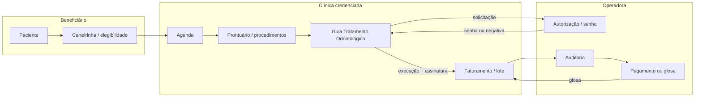

# Dental Seven v8 — Convênios e Planos Odontológicos Design Spec

**Versão:** 1.1  
**Data:** 2026-07-10  
**Status:** ✅ Aprovada (2026-07-10) — implementação na fila pós-beta item 7, após anamnese  
**Aprovação:** usuário confirmou recomendações: módulo standalone `/convenios`, plano Inteligente+, fases v8.0→v8.2, execução subagent-driven quando chegar a vez na fila  
**Pré-requisitos:** v5 Financeiro, v3 Procedimentos, v2.5+ Prontuário concluídos em `feat/v2`  
**Specs relacionadas:**  
- `2026-07-02-v5-financeiro-design.md`  
- `2026-07-02-v3-procedimentos-design.md`  
- `2026-06-15-estrategia-modularidade-billing-ia.md`  
- `2026-07-03-atestado-cid-design.md` (menção a exigências de convênios)

**Princípio de produto:** **MicroSaaS enxuto** — reduzir glosas por padronização e validação prévia, sem tentar replicar ERP de operadora. Fases incrementais; TISS/XML só quando a base clínica estiver sólida.

---

## 1. Contexto de mercado e problema

### 1.1 O que é glosa (revisão do post LinkedIn)

**Glosa** = não autorização e/ou não pagamento de procedimento odontológico pela operadora. Causas mais frequentes no credenciado:

| Causa | Como o software ajuda |
|-------|------------------------|
| Divergência na documentação | Checklist pré-envio + vínculo prontuário↔guia |
| Falta de clareza nas diretrizes de cobertura | Cadastro de regras por operadora/plano na clínica |
| Erros em guias ou prontuários | Validação de campos obrigatórios antes de gerar GTO |
| Procedimento sem autorização prévia | Flag de autorização + senha + bloqueio de faturamento |

Estratégias citadas (treinamento, padronização, tecnologia, feedback) mapeiam para **fluxos no sistema**, não para conteúdo educacional dentro do app na v1.

### 1.2 Relação paciente / clínica / operadora



**Fluxo regulatório (ANS / TISS):**

1. **Elegibilidade** — no atendimento: carteirinha + documento; consulta portal da operadora quando possível.
2. **Autorização** — GTO via portal TISS/Web Guia da operadora; senha numérica para procedimentos que exigem pré-autorização.
3. **Execução** — registro clínico (odontograma, evolução) alinhado ao que foi autorizado.
4. **Faturamento** — lote de guias → XML TISS (padrão ANS) ou portal → demonstrativo de pagamento.
5. **Glosa / recurso** — identificar motivo, corrigir documentação, reenviar dentro do prazo.

**Importante:** Dental Seven é software da **clínica credenciada**, não da operadora. Escopo = credenciamento local, vínculo paciente-plano, guias derivadas do atendimento, controle de glosas e integração financeira.

### 1.3 O que concorrentes oferecem

| Produto | Abordagem | Destaques |
|---------|-----------|-----------|
| **Feegow Clinic/Odonto** | Módulo **Faturamento** separado | Cadastro convênios, tabela TUSS, validação XML, lotes, glosas, integração financeiro |
| **Clínica nas Nuvens** | TISS + gestão glosas | Export XML, recurso de glosa, elegibilidade |
| **ClínicaSys Pro** | TISS v3.05 incluso | XML Uniodonto, Odontoprev, Bradesco Dental; controle glosas |
| **Medicina Direta** | Faturamento convênio + Omie | Guias odontológicas, glosas, ERP financeiro |
| **Apolo / ByDoctor** | Auditor prévio | Validação antes do envio; meta &lt;3% glosa vs 8–18% manual |
| **TOTVS Saúde Planos** | Lado **operadora** | Autorização, glosas, portal prestador — referência de domínio, não concorrente direto da clínica |

**Padrão de mercado:** módulo dedicado (não só aba do financeiro), integrado a paciente, agenda, procedimentos e financeiro. TISS/XML é table stakes para clínicas com volume de convênio.

### 1.4 Estado atual no Dental Seven

- **Zero** implementação de convênio, TISS, glosa ou carteirinha.
- Pacientes: nome, contato, notas — sem plano.
- Procedimentos: `base_price_cents` particular único.
- Financeiro: receita ao concluir consulta — sem distinção particular/convênio.
- Infra pronta: `clinic_modules`, padrão `fornecedores/`, hooks na agenda (`applyFinanceForAppointmentStatusChange`).

---

## 2. Objetivo

Entregar módulo **Convênios** para clínicas que atendem planos odontológicos: cadastro de operadoras/planos credenciados, vínculo do paciente, tabela de preços por procedimento, tipo de pagamento na agenda, rastreamento manual de guias e glosas, integração leve com financeiro — preparando terreno para GTO/TISS em fase posterior.

**Métrica de sucesso (v8.0):** clínica consegue registrar atendimento convênio ponta a ponta (paciente → agenda → procedimento → guia em status → recebível financeiro) sem planilha externa.

---

## 3. Onde colocar no produto — três abordagens

### Opção A — Submódulo dentro de Financeiro

- **Prós:** receita de convênio já é financeiro; um menu a menos.
- **Contras:** convênio toca paciente, agenda, procedimentos, prontuário; financeiro ficaria sobrecarregado; difícil evoluir para GTO/TISS.

### Opção B — Módulo standalone `/convenios` **(Recomendado)**

- **Prós:** alinhado a Feegow/Medicina Direta; `module_key` próprio; CRUD + dashboard de glosas; integrações pontuais nas telas existentes (padrão `fornecedores`).
- **Contras:** mais um item na sidebar (mobile: priorizar no menu ou agrupar futuro).

### Opção C — Distribuído (só Configurações + chips nas telas)

- **Prós:** contextual.
- **Contras:** difícil descobrir; inconsistente com DR7; glosas ficam órfãs.

**Recomendação:** **Opção B** — rota `/convenios`, label **Convênios**, ícone `Building2` ou `Shield`. Integrações:

| Onde | O quê |
|------|--------|
| `/convenios` | Hub: operadoras, planos, tabela preços, guias, glosas |
| Ficha paciente | Seção "Plano odontológico" (carteirinha, validade, titular) |
| Agenda (modal) | `Particular` \| `Convênio` + select plano |
| `/procedimentos` | Coluna/link TUSS + preço convênio (read-only link para `/convenios`) |
| `/financeiro` | Card "A receber convênios" + filtro por operadora (link para `/convenios`) |

---

## 4. Decisões

| # | Decisão |
|---|---------|
| 1 | **`module_key`:** `convenios` |
| 2 | **Plano comercial:** **Inteligente** e **Completo** (junto com financeiro) |
| 3 | **Permissões v8.0:** `clinic_admin` CRUD; `dentist` vê plano do paciente na ficha e seleciona convênio na agenda (somente leitura em `/convenios`) |
| 4 | **Escopo v8.0:** cadastro + vínculo paciente + preços + guia manual + status glosa — **sem** XML TISS |
| 5 | **Escopo v8.1:** gerar PDF/checklist GTO a partir do atendimento |
| 6 | **Escopo v8.2:** export XML TISS + lotes + recurso glosa estruturado |
| 7 | **Preço:** `procedures.base_price_cents` = particular; tabela `insurance_procedure_prices` = override por plano |
| 8 | **Financeiro:** ao concluir consulta convênio, criar `financial_entry` tipo `insurance_receivable` (pendente) em vez de `revenue` imediata |
| 9 | **Demo:** `DEMO_MOCK_DATA=true` — operadoras exemplo (Uniodonto, Odontoprev) desabilitadas para escrita |
| 10 | Branch **`feat/v2`** — produção intocável |
| 11 | Migration: `024_insurance_convenios.sql` (número a confirmar na implementação) |
| 12 | Nomenclatura UI: **Convênio** / **Operadora** / **Plano** — evitar confusão com planos comerciais DR7 (Essencial, Conecta…) |

---

## 5. Escopo por fase

### v8.0 — Fundação (este plano)

**Incluído:**

- CRUD operadoras (`insurance_carriers`) e planos (`insurance_plans`) credenciados pela clínica
- Credencial da clínica na operadora (código prestador, observações, regras texto)
- Vínculo paciente ↔ plano (`patient_insurance_enrollments`)
- Tabela preço procedimento × plano + código TUSS opcional
- Campo pagamento na agenda: `particular` \| `insurance`
- Entidade `insurance_claims` (guia): procedimentos, valor, status, motivo glosa
- Dashboard convênios: guias pendentes / glosadas / pagas
- Integração financeiro: recebível pendente + baixa ao marcar pago
- Menu, module gating, smoke script

**Fora do escopo v8.0:**

- XML TISS / webservice operadora
- Autorização online / elegibilidade API
- Recurso de glosa com workflow multi-etapa
- Coparticipação / franquia automática
- Múltiplas guias por consulta com anexo situação inicial odontológica
- Integração Omie/contabilidade

### v8.1 — GTO assistida

- Template PDF "Guia Tratamento Odontológico" pré-preenchido do prontuário
- Checklist validação (autorização, TUSS, dente/face, assinatura)
- Anexo situação inicial (link odontograma)

### v8.2 — TISS

- Export XML ANS v3.05+
- Lotes, protocolo, import demonstrativo pagamento (CSV manual inicial)
- Recurso glosa com histórico

---

## 6. Modelo de dados (v8.0)

```sql
-- Operadora (Bradesco Dental, Odontoprev, Uniodonto local…)
create table insurance_carriers (
  id uuid primary key default gen_random_uuid(),
  clinic_id uuid not null references clinics(id) on delete cascade,
  name text not null,
  ans_registry text,                    -- registro ANS quando aplicável
  provider_code text,                 -- código credenciado na operadora
  portal_url text,
  notes text default '',
  is_active boolean not null default true,
  created_at timestamptz not null default now(),
  updated_at timestamptz not null default now()
);

-- Plano dentro da operadora (ex.: "Pleno", "Básico empresarial")
create table insurance_plans (
  id uuid primary key default gen_random_uuid(),
  clinic_id uuid not null references clinics(id) on delete cascade,
  carrier_id uuid not null references insurance_carriers(id) on delete cascade,
  name text not null,
  requires_pre_auth boolean not null default false,
  coverage_notes text default '',     -- regras livres (diretrizes)
  is_active boolean not null default true,
  created_at timestamptz not null default now(),
  updated_at timestamptz not null default now(),
  unique (clinic_id, carrier_id, name)
);

-- Vínculo paciente
create table patient_insurance_enrollments (
  id uuid primary key default gen_random_uuid(),
  clinic_id uuid not null references clinics(id) on delete cascade,
  patient_id uuid not null references patients(id) on delete cascade,
  plan_id uuid not null references insurance_plans(id) on delete restrict,
  card_number text not null,
  holder_name text,                   -- titular se dependente
  valid_until date,
  is_primary boolean not null default true,
  created_at timestamptz not null default now(),
  updated_at timestamptz not null default now()
);

-- Preço convênio (override)
create table insurance_procedure_prices (
  id uuid primary key default gen_random_uuid(),
  clinic_id uuid not null references clinics(id) on delete cascade,
  plan_id uuid not null references insurance_plans(id) on delete cascade,
  procedure_id uuid not null references procedures(id) on delete cascade,
  price_cents integer not null check (price_cents >= 0),
  tuss_code text,
  created_at timestamptz not null default now(),
  updated_at timestamptz not null default now(),
  unique (plan_id, procedure_id)
);

-- Status da guia
create type insurance_claim_status as enum (
  'draft',
  'awaiting_auth',
  'authorized',
  'submitted',
  'paid',
  'partial_glosa',
  'glosa',
  'appealing'
);

-- Guia / claim (manual v8.0)
create table insurance_claims (
  id uuid primary key default gen_random_uuid(),
  clinic_id uuid not null references clinics(id) on delete cascade,
  patient_id uuid not null references patients(id) on delete restrict,
  plan_id uuid not null references insurance_plans(id) on delete restrict,
  appointment_id uuid references appointments(id) on delete set null,
  procedure_id uuid references procedures(id) on delete set null,
  status insurance_claim_status not null default 'draft',
  auth_password text,                 -- senha operadora
  submitted_amount_cents integer not null check (submitted_amount_cents >= 0),
  paid_amount_cents integer check (paid_amount_cents >= 0),
  glosa_reason text default '',
  glosa_amount_cents integer check (glosa_amount_cents >= 0),
  submitted_at date,
  paid_at date,
  notes text default '',
  created_at timestamptz not null default now(),
  updated_at timestamptz not null default now()
);

-- Agenda: origem pagamento
alter table appointments
  add column payment_source text not null default 'particular'
    check (payment_source in ('particular', 'insurance')),
  add column insurance_plan_id uuid references insurance_plans(id) on delete set null;

-- Financeiro: novo tipo
alter type financial_entry_type add value if not exists 'insurance_receivable';
alter type financial_entry_type add value if not exists 'insurance_receivable_reversal';
```

**RLS:** mesma política `clinic_id = current_clinic_id()` em todas as tabelas novas.

---

## 7. Regras de negócio

### 7.1 Permissões

| Ação | clinic_admin | dentist |
|------|--------------|---------|
| `/convenios` CRUD operadoras/planos/preços | ✅ | ❌ redirect |
| Ver guias e glosas | ✅ | ❌ |
| Cadastrar plano no paciente | ✅ | ✅ |
| Selecionar convênio na agenda | ✅ | ✅ |
| Marcar guia paga / registrar glosa | ✅ | ❌ |

### 7.2 Agenda → Financeiro

- `payment_source = particular`: comportamento atual (`revenue` ao concluir).
- `payment_source = insurance` + `insurance_plan_id`:
  - Preço = `insurance_procedure_prices` se existir; senão alerta admin (não bloqueia conclusão v8.0).
  - Ao concluir: criar `insurance_claim` em `draft` + `financial_entry` `insurance_receivable`.
  - Ao marcar guia `paid`: converter recebível em `revenue` (ou ajuste parcial se glosa).

### 7.3 Glosa (v8.0 manual)

- Admin altera status para `glosa` ou `partial_glosa`, preenche `glosa_reason` e valores.
- Dashboard lista guias glosadas com operadora e paciente para ação.

### 7.4 Paywall

- Escrita bloqueada se assinatura inativa (`assertWritableAdmin`), padrão v5.

---

## 8. UI — `/convenios`

**Abas (tabs):**

1. **Operadoras** — lista + modal CRUD carrier/planos aninhados
2. **Tabela de preços** — matriz procedimento × plano (filtro por operadora)
3. **Guias** — kanban ou tabela filtrável por status
4. **Glosas** — filtro rápido `status in (glosa, partial_glosa, appealing)`

**Empty states:** orientar cadastrar operadora → plano → preço → vincular paciente.

---

## 9. Integrações existentes

| Módulo | Alteração |
|--------|-----------|
| `pacientes` | Formulário + ficha: enrollment |
| `agenda` | Select payment_source + plano |
| `financeiro` | Card recebíveis convênio; hook em `appointment-finance.ts` |
| `procedimentos` | Campo TUSS opcional em `procedures` (migration) ou só na tabela de preços |
| `nav-links` / `filter-nav` / `plans.ts` | Módulo `convenios` |
| Export LGPD | Schema 1.7+ com tabelas convênio |

---

## 10. Posição no roadmap DR7

| Versão | Item | Dependência |
|--------|------|-------------|
| Pré-beta | Odontograma, deploy | em curso |
| pós-beta | Anamnese v3.7 | fila §5 |
| **v8.0** | **Convênios fundação** | financeiro + procedimentos |
| v8.1 | GTO PDF | v8.0 + prontuário |
| v8.2 | TISS XML | v8.1 |

**Não antecipar antes da beta** salvo decisão explícita do usuário — escopo grande e nicho (clínicas com convênio).

---

## 11. Riscos e mitigações

| Risco | Mitigação |
|-------|-----------|
| Complexidade TISS | Fasear; v8.0 manual |
| Confusão plano DR7 vs plano odontológico | Copy/UI: "Plano do paciente" vs "Seu plano Dental Seven" |
| Clínicas 100% particular | Módulo off por plano comercial; zero ruído |
| Versionamento ANS | v8.2+ com validador externo / lib dedicada |

---

## 12. Critérios de aceite v8.0

- [x] Admin cadastra operadora + plano + preço de procedimento
- [x] Paciente vinculado com carteirinha
- [x] Consulta marcada como convênio na agenda
- [x] Ao concluir consulta, guia `draft` criada (recebível = base caixa, ver nota)
- [x] Admin registra glosa e valor pago; financeiro reflete (receita ao pagar)
- [x] Dentista não acessa CRUD `/convenios`
- [x] Módulo gated em Inteligente+; menu oculto em Essencial/Conecta
- [x] `npm run test` (242) e `npm run build` passam
- [~] Smoke `scripts/smoke-convenios.ts` — substituído por verificação test+build

**Status:** ✅ Implementado em `feat/v2` (2026-07-10). Migration `025_insurance_convenios`. Módulo `src/modules/convenios/`.

**Nota (recebível base caixa):** diferente do rascunho, **não** foram adicionados valores ao enum `financial_entry_type`. O recebível de convênio é representado pelas guias em aberto (`insurance_claims`); ao marcar a guia como paga, um lançamento `revenue` normal entra no ledger. Ver "Desvios de arquitetura" no plano.

---

## 13. Referências

- ANS — Padrão TISS (Componente Organizacional, guias odontológicas)
- Manual preenchimento Guias Odontológicas TISS
- Feegow — Faturamento TISS / gestão convênios
- Clínica nas Nuvens — faturamento TISS e glosas
- Post LinkedIn Pedro Andrade — gestão de glosas (nov/2024)
